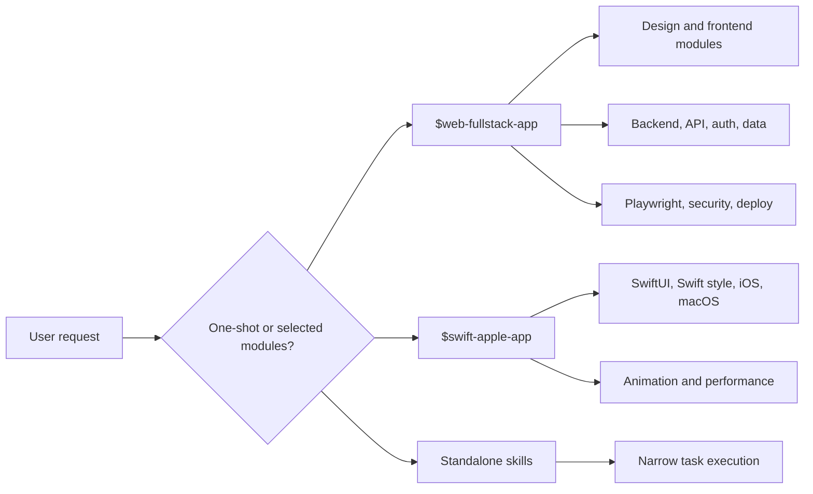

# Architecture

The pack is organized around progressive disclosure: small entry skills choose focused reference modules only when needed.



## Repository Layout

```text
.
├── assets/             # Project icon and visual assets
├── docs/               # Human-facing documentation
├── scripts/            # Installer and validation scripts
├── site/               # Deno-powered static project webpage
└── skills/             # Installable Codex skills
```

## Skill Layout

Each installable skill follows the standard structure:

```text
skill-name/
├── SKILL.md
├── agents/openai.yaml
├── references/
├── scripts/
└── assets/
```

Not every skill has every optional directory.

## Orchestration Strategy

- `web-fullstack-app` is the web/product orchestrator.
- `swift-apple-app` is the Apple-platform orchestrator.
- Standalone modules remain installable and callable by name.
- Bundled reference copies inside orchestrators allow one-shot workflows without losing module depth.

## Design Choice

This repo intentionally keeps modules composable. A single fixed workflow is too rigid for real product work; custom blends let you choose the minimum useful capability set.
