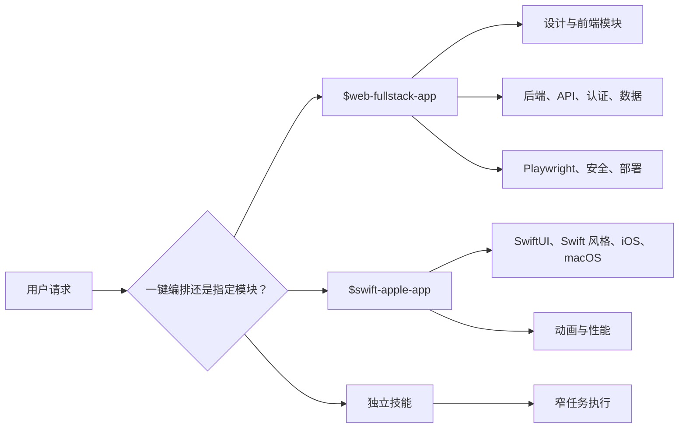

# 架构说明

[English](../architecture.md) | 简体中文

这个技能包围绕 progressive disclosure 组织：入口技能保持轻量，只在任务需要时再选择具体参考模块。



## 仓库结构

```text
.
├── assets/             # 项目图标和视觉资产
├── docs/               # 面向使用者的文档
├── scripts/            # 安装器和验证脚本
├── site/               # Deno 驱动的静态项目网页
└── skills/             # 可安装 Codex 技能
```

## 技能结构

每个可安装技能遵循标准结构：

```text
skill-name/
├── SKILL.md
├── agents/openai.yaml
├── references/
├── scripts/
└── assets/
```

不是每个技能都会包含所有可选目录。

## 编排策略

- `web-fullstack-app` 是 Web/产品方向的主编排技能。
- `swift-apple-app` 是 Apple 平台主编排技能。
- 独立模块仍然可以安装并按名称直接调用。
- 编排技能内部保留模块引用副本，让一键工作流不牺牲深度。

## 设计选择

这个仓库刻意保持模块可组合。真实产品工作很少只有一种固定流程；自定义组合可以让你用最小、最合适的能力集完成任务。
